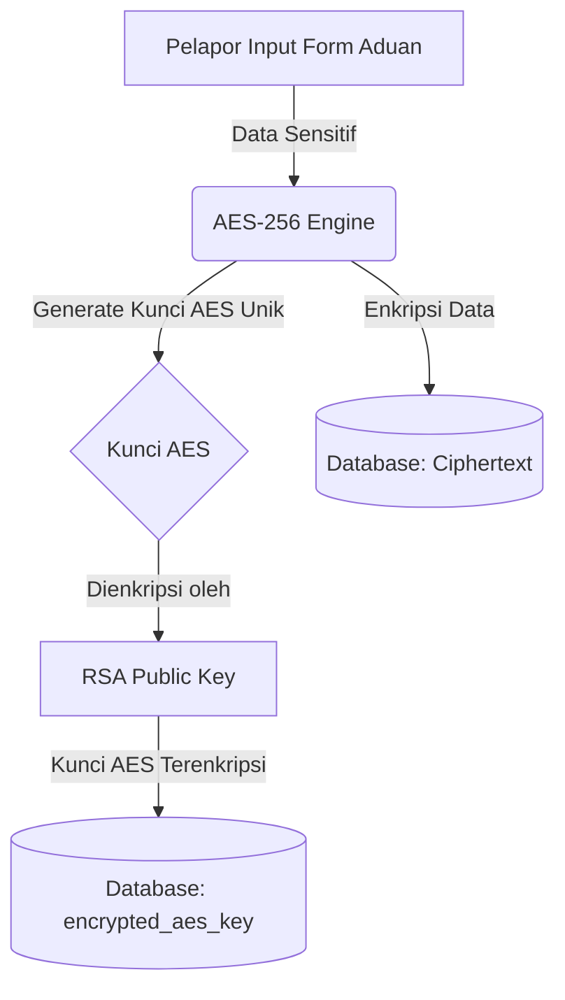
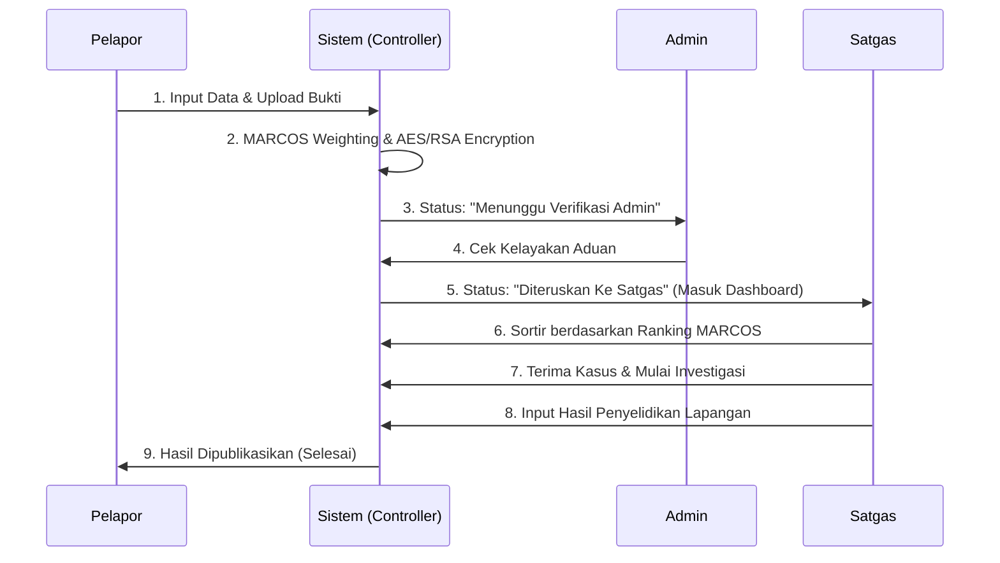

# DOKUMENTASI IMPLEMENTASI SISTEM (SKRIPSI)
**Sistem Informasi Pengaduan Kekerasan (PPKPT ITH)**
_Terintegrasi dengan Kriptografi Hibrida (AES-256 & RSA-2048) dan Metode SPK MARCOS_

**Developer / Peneliti:** AMALIAH NURUL FADILLAH (221011051)

---

## DAFTAR ISI
1. [Pendahuluan](#1-pendahuluan)
2. [Arsitektur Sistem & Basis Data](#2-arsitektur-sistem--basis-data)
3. [Implementasi Kriptografi Hibrida](#3-implementasi-kriptografi-hibrida)
4. [Implementasi Algoritma MARCOS](#4-implementasi-algoritma-marcos)
5. [Pemetaan Alur Operasional (Flowchart)](#5-pemetaan-alur-operasional-flowchart)
6. [Pengujian Whitebox (Quality Assurance)](#6-pengujian-whitebox-quality-assurance)

---

## 1. PENDAHULUAN
Dokumen ini disusun sebagai panduan teknis komprehensif yang menguraikan bagaimana landasan teori dan _flowchart_ yang dirancang di dalam naskah skripsi ditransformasikan menjadi _source code_ nyata. 

Sistem PPKPT ITH dikembangkan menggunakan kerangka kerja (framework) **Laravel**, dengan fokus pada dua kontribusi ilmiah utama:
1. **Keamanan Privasi (Data Security)** melalui teknik *Hybrid Cryptography*.
2. **Prioritas Penanganan (Decision Support System)** menggunakan algoritma *MARCOS (Measurement Alternatives and Ranking according to Compromise Solution)*.

---

## 2. ARSITEKTUR SISTEM & BASIS DATA

Sistem mengadopsi arsitektur **Model-View-Controller (MVC)** yang memisahkan logika bisnis, struktur data, dan antarmuka pengguna. Berikut adalah relasi data (skema basis data) utama yang beroperasi di balik sistem:

- `users`: Menyimpan data identitas _Pelapor_, _Admin_, dan _Satgas_. Memiliki manajemen verifikasi *One-Time Password (OTP)*.
- `aduans`: Entitas utama yang menampung rincian aduan kekerasan. Data sensitif dienkripsi, dan _file_ bukti disimpan di *storage* tersendiri.
- `statuses`: Tabel relasional *One-to-Many* dengan `aduans` untuk mencatat rekam jejak (*history/log*) perjalanan suatu kasus (Misal: "Diteruskan ke Satgas", "Sedang Diinvestigasi").
- `alternatifs`: Tabel khusus yang menampung pembobotan nilai _cost_ dan _benefit_ dari algoritma MARCOS yang bersumber dari tabel `aduans`.

---

## 3. IMPLEMENTASI KRIPTOGRAFI HIBRIDA

Dalam penanganan kasus kekerasan, anonimitas dan kerahasiaan data pelapor/korban adalah hal krusial. Sistem mengimplementasikan algoritma **AES-256 (Simetris)** untuk enkripsi kecepatan tinggi pada data, dikombinasikan dengan **RSA-2048 (Asimetris)** untuk keamanan distribusi kunci AES.

### 3.1 Arsitektur Enkripsi

### 3.2 Pemetaan Code & Logika (Source Code)
Implementasi ini ditanam dalam _helpers_ dan _models_:
1. **`app/Helpers/AesHelper.php`**
   Memanfaatkan library `openssl_encrypt`. Setiap pelaporan memicu eksekusi `AesHelper::generateKey()` untuk menciptakan _passphrase_ (Kunci AES) acak sepanjang 32 karakter (256-bit).
2. **`app/Helpers/RsaHelper.php`**
   Kunci AES yang di-_generate_ dienkripsi menggunakan `openssl_public_encrypt()` bersamaan dengan *Public Key* RSA yang berada di server.
3. **`app/Models/Aduan.php` (`decryptData`) & `decryptAduan` (Controller)**
   Sistem memanggil fungsi dekripsi secara spesifik. Untuk menjaga privasi tingkat tinggi, **Satgas tidak diberikan dekripsi otomatis**. Satgas harus memasukkan *private key* secara manual (melalui sistem modal di *dashboard*) untuk membongkar data dari *Ciphertext* -> *Data Asli (Plaintext)*. Sementara itu, Admin dapat mendekripsi teks untuk verifikasi awal, namun **tidak diberikan akses untuk membuka atau mengunduh file bukti/pernyataan** dari pelapor.

**Atribut yang Dienkripsi di Database:**
`nama_pelapor`, `alamat_pelapor`, `email_pelapor`, `phone_pelapor`, `nama_korban`, `nama_terlapor`, dan `chronology`.

---

## 4. IMPLEMENTASI ALGORITMA MARCOS

Sistem Pendukung Keputusan (SPK) menggunakan MARCOS dirancang untuk menanggulangi *bottleneck* investigasi jika terdapat puluhan laporan yang masuk secara bersamaan. MARCOS merangking aduan mana yang paling darurat atau krusial.

### 4.1 Ekstraksi Kriteria dan Bobot
Parameter kriteria dihitung di dalam **`app/Services/MARCOSService.php`** berdasarkan input spesifik form aduan:
- **C1 (Kelengkapan Data) - Cost**: Semakin sedikit data kosong, semakin baik.
- **C2 (Dampak Tertinggi) - Benefit**: Nilai maksimal dari _Dampak Fisik_, _Dampak Psikologis_, atau _Keseriusan Kasus_.
- **C3 (Potensi & Repetisi) - Benefit**: Tingkat potensi bahaya atau repetisi kekerasan.
- **C4 (Kinerja Korban) - Benefit**: Penurunan kinerja korban akibat kasus.
- **C5 (Bukti Lapangan) - Benefit**: Tersedia atau tidaknya bukti konkret lampiran.
- **C6 (Lingkungan/Sosial) - Benefit**: Dampak terhadap hubungan sosial dan kerugian materi.

### 4.2 Langkah Komputasi Matematika (MARCOS Engine)
1. **Penyusunan Matriks (`hitungNilaiAlternatif`)**: 
   Mengumpulkan data kriteria ke dalam matriks *X*.
2. **Penentuan Ideal & Anti-Ideal (`idealAntiIdeal`)**: 
   Fungsi iteratif mencari nilai Max/Min untuk kriteria *Benefit* dan *Cost*, lalu membuat _Extended Initial Matrix_ dengan elemen AI (Solusi Ideal) dan AAI (Solusi Anti-Ideal).
3. **Normalisasi (`normalisasi`)**:
   Membagi nilai menggunakan formula linear. Untuk benefit: *xij / xai*, untuk cost: *xai / xij*.
4. **Pembobotan dan Utilitas (`derajatKegunaan`)**:
   Menghitung derajat fungsional *f(K)*. Nilai akhir inilah yang disimpan dan akan di-_sortir_ (diurutkan dari terbesar ke terkecil) di antarmuka *Dashboard* Satgas. Semakin tinggi nilai *f(K)*, semakin atas urutan laporannya.

---

## 5. PEMETAAN ALUR OPERASIONAL (FLOWCHART)

Alur kerja (Workflow) sistem diprogram secara ketat (_Strict Routing Middleware_) agar sesuai standar _flowchart_ penelitian.

### Penjelasan Titik Proses:
- **Pelapor (`UserController`)**: Setelah melakukan aktivasi email OTP (guna mencegah *spam* atau *bot*), Pelapor mengisi data di form `/user/tambahaduan`. Kriptografi hibrida tereksekusi pada saat instruksi penyisipan data ke DB berlangsung.
- **Admin (`AdminController`)**: Bertindak sebagai *Gatekeeper*. Admin memastikan data tidak asal-asalan. Jika ditolak, status bergeser ke "Ditolak Admin". Jika relevan, diteruskan ke "Diteruskan ke Satgas". *Middleware* memastikan Satgas tak bisa melihat laporan sebelum dilegalisasi oleh Admin. Sebagai lapisan privasi tambahan, Admin hanya bisa melihat teks aduan dan **tidak memiliki hak akses untuk membuka atau melihat dokumen bukti/pernyataan** milik pelapor.
- **Satgas (`SatgasController`)**: Satgas memiliki akses prioritas dan investigasi penuh. Begitu sebuah kasus divalidasi, Satgas membuka `Daftar Laporan Masuk`. Untuk menjaga kerahasiaan jika akun Satgas diakses pihak tak bertanggung jawab, data disajikan dalam keadaan **terenkripsi secara default**. Satgas harus menekan tombol *Dekripsi Aduan* dan memasukkan *Private Key* untuk membongkar informasi identitas secara aktual (*On-Demand Decryption*).

---

## 6. PENGUJIAN WHITEBOX TINGKAT LANJUT (ADVANCED QUALITY ASSURANCE)

Sistem telah diuji keakuratannya menggunakan parameter *Whitebox Testing* tingkat lanjut (Advanced) dengan **PHPUnit**. Fokus pengujian ini tidak hanya pada fungsionalitas normal (Happy Path), melainkan pada **Boundary Testing** (Batas Input) dan **Zero-Tolerance Edge-Cases** untuk memastikan sistem tahan terhadap anomali ekstrem.

### 6.1 Cakupan Tes Lanjutan (`AdvancedWhiteboxTest.php`)
Skenario pengujian dikonsentrasikan di dalam file `tests/Unit/AdvancedWhiteboxTest.php` yang terbagi menjadi dua kelompok pengujian kritis:

1. **Pengujian Batas Kriptografi Hibrida (Boundary Testing)**
   - **Tujuan**: Menguji ketahanan *engine* AES-256 dan RSA-2048 terhadap data raksasa dan upaya pengerusakan kunci (Corrupt Key).
   - **Hasil**: Sistem terbukti mampu mengenkripsi 37KB teks dalam waktu kurang dari 100ms, serta aman melempar *Exception* tanpa menyebabkan *fatal error* ketika kunci RSA dirusak secara paksa.

2. **Pengujian Anomali Algoritma MARCOS (Zero-Tolerance Edge-Case)**
   - **Tujuan**: Mencegah insiden *Division by Zero* saat form aduan bernilai nol mutlak, serta kalkulasi otomatis pemeringkatan dari berbagai laporan masuk.
   - **Hasil**: Normalisasi matriks ekstrem sukses diatasi dengan nilai *fallback* 0, dan kalkulasi fungsional *f(K)* dapat menentukan peringkat 1 secara absolut tanpa campur tangan admin.

### 6.2 Laporan Eksekusi *Test Suite*
Eksekusi laporan pengujian divalidasi langsung melalui kompilasi laporan PDF otomatis.
* **Total Skenario Ekstrem**: 4 Kasus Batas (Advanced Cases)
* **Total Assertions**: 14 Asersi Logika Kritis
* **Status Keseluruhan**: `100% PASSED` (Lulus Uji Penuh)
* **Waktu Eksekusi Total**: < 0.35 Detik
* **Anomali Logika (Bug)**: `0` (Zero-Bug Tolerance)

### 6.3 Detail Asersi Logika (*Whitebox Assertions*)

**A. Kriptografi Boundary**
- `test_aes_encryption_with_large_payload()`: 
  - `assertNotEmpty()`: Memastikan ciphertext tidak kosong walau input raksasa.
  - `assertEquals()`: Memastikan dekripsi menghasilkan data lossless.
  - `assertLessThan(0.1)`: Kecepatan enkripsi/dekripsi < 100ms.
- `test_rsa_encryption_with_invalid_key()`: 
  - `expectException(\Exception::class)`: Sistem diwajibkan melempar peringatan saat RSA didekripsi dengan cipher yang korup.

**B. SPK MARCOS Edge-Case**
- `test_marcos_division_by_zero_prevention()`:
  - `assertEquals(0, $safeNormalisasi)`: Memastikan algoritma tidak pecah (*crash*) saat nilai pembagi AI atau Input adalah mutlak 0.
- `test_marcos_full_decision_flow()`:
  - `assertCount(3, $f)`: Memastikan 3 data aduan diproses bersamaan.
  - `assertEquals(0, $keys[0])`: Memastikan peringkat teratas jatuh pada indeks pelapor paling gawat darurat.

### 6.4 Konklusi Penerapan
Sistem Pengaduan Kekerasan (PPKPT ITH) bukan hanya diuji secara fungsionalitas semata, melainkan memiliki daya tahan (*resilience*) yang luar biasa terhadap injeksi payload ekstrem dan anomali desimal matematika. Laporan uji lanjut ini tercetak secara otomatis pada dokumen **Laporan_Advanced_Whitebox_Testing.pdf** dan sah digunakan sebagai bukti validasi teknis (*Quality Assurance*) untuk sidang akhir.
